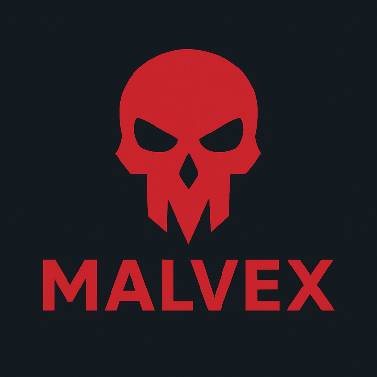
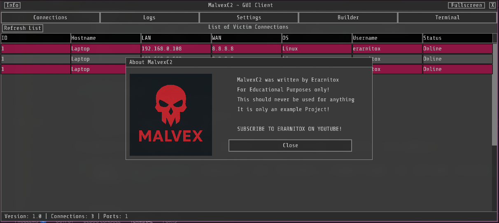
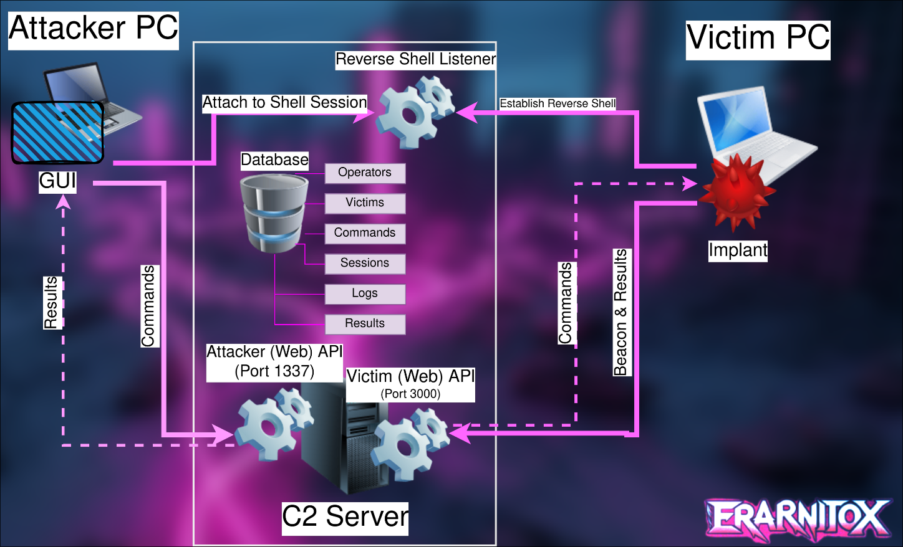
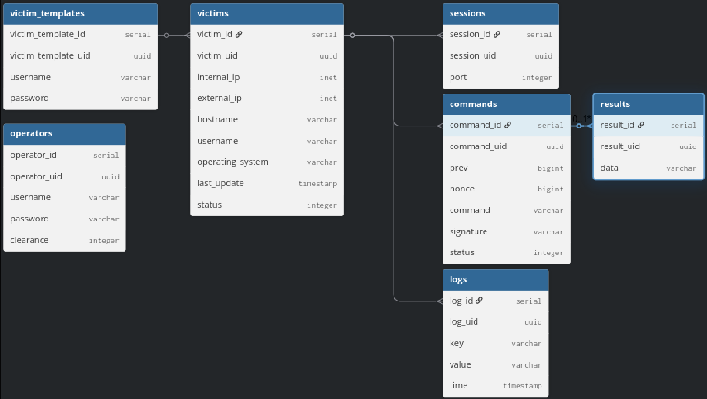

> [!WARNING]
> **Work in Progress:** This is a WIP side project that is incomplete and insecure! It is only meant to be used as a playground for myself

> [!CAUTION]
> **Use at your own risk:** Code in this repository might be harmful. Only run and use things you understand!

# Malvex C2

Welcome to the repository of the Malvex C2 framework. It is meant as an educational C2 Framework to show you how other C2 frameworks might work and operate.
It will also mature and be extended upon as time goes on. The goal is however to keep it as simple and easy to understand as possible.
So it might be used as a base for your very own C2 framework. The Ccurrent Implant only supports Linux based machines

## Viedeo Overview:

## Design Goals
Other C2 Frameworks are highly complex and hard to adapt, extend understand or port to other platforms.
My goal is to have something simple, but solid, that is platform independent and easy to understand and adapt.
That way this C2 framework should offer a perfect base for your to build your functionality on top of (once it is more mature).
Everything, the client, server and implant are written in modern C++ and are contained within the same "project"

## Installation
1) Download the latest Release.zip
2) scp the server.elf onto your Linux based C2 server
3) run the server.elf and go through the setup process
4) Extract the client directory to your Linux PC
5) Run the client.elf from the extracted directory
6) Enter your server credentials
7) Under the "Builder" Tab in the client you can configure the implant
8) Once configured implant is run it will reach out to the C2 server and you will have full control over it

## Features
- easy installation
- easy configuation
- cool looking UI
- remote shell management
- credential stealer
- keylogger
- beaconing over HTTPS
- Browser Impersonation for Beaconing
- Systemd service based persistance

### Architecture Overview

### Database Overview

## Extending
Malvex is designed to be modular.

This section might be populated later if there is enough legitimate interest.

### Custom Implants
The framework is structured to allow for Windows (PE)
or macOS (Mach-O) implants to be integrated with minimal changes to the Server/Client communication protocol.

> **Interested in More?:** __View "Conatact" to contact me!__

### Adding Commands

## Credits
- Me, for coding this
- **Libraries used:**
    - [cpppwn](https://github.com/Erarnitox/CPPpwn)
    - [Glaze](https://github.com/stephenberry/glaze)
    - [SQLiteCpp](https://github.com/SRombauts/SQLiteCpp)
    - [Raylib/Raygui](https://github.com/raysan5/raygui).

## Contact
- **Discord:** @erarnitox

## License
This project is licensed under the **MIT License**.
See the [LICENSE](LICENSE) file for the full text.

Copyright (c) 2026 erarnitox.